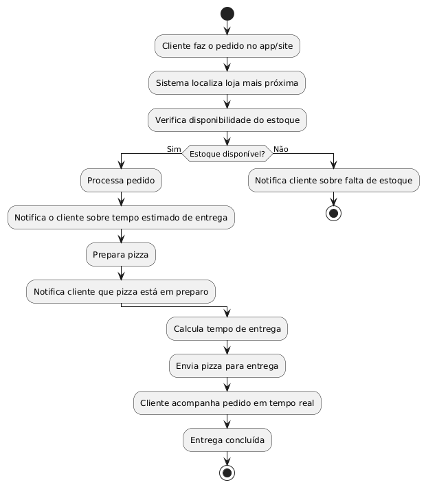
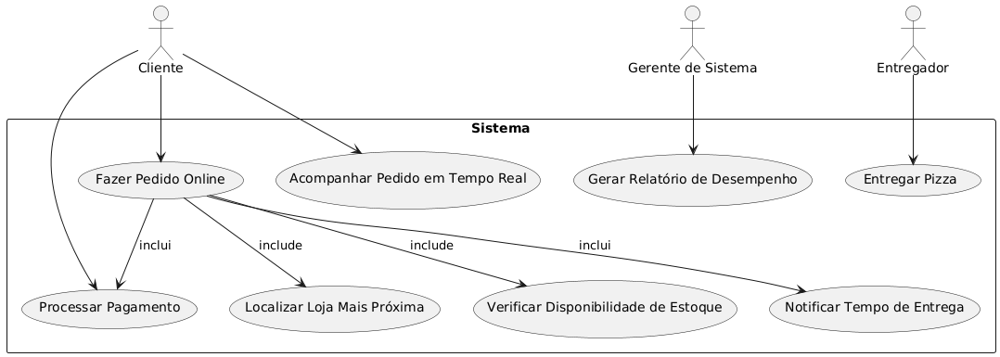

<h2><a href= "https://www.mackenzie.br">Universidade Presbiteriana Mackenzie</a></h2>
<h3><a href= "https://www.mackenzie.br/graduacao/sao-paulo-higienopolis/sistemas-de-informacao">Sistemas de Informação</a></h3>

**Pizza-Express**

---

<h4>Autores:</h4>
<ul>
<li>Danilo Abude Gigliotti - RA 10443431</li>
<li>Gabriel Branco Urbinati - RA 10443760</li>
<li>Davi Portes - RA 10417139</li>
<li>Renato Gonçalves Ribeiro - RA 10410267</li>
</ul>

<h4>Professor:</h4>

Rodrigo Silva

---

<h2>1. Introdução do Projeto</h2>

O projeto <b>Pizza-Express</b> visa otimizar o processo de pedidos e entregas de pizzas por meio de um sistema integrado que permite aos clientes realizarem pedidos online, acompanharem o status em tempo real e receberem suas entregas de forma eficiente. A solução envolve o desenvolvimento de um sistema que localiza a loja mais próxima, processa o pedido, calcula o tempo de entrega e gerencia o estoque e as operações internas das lojas.

O objetivo é aumentar a competitividade da Pizza-Express, que enfrenta a perda de 30% de suas vendas devido à concorrência. O sistema proposto atenderá às necessidades operacionais, melhorando a eficiência e a satisfação do cliente.

---

<h2>2. Análise de Requisitos Funcionais e Não Funcionais</h2>

<h4>Requisitos Funcionais:</h4>
<ol>
<li><b>Localização da loja mais próxima:</b> O sistema deve localizar automaticamente a loja mais próxima com base no endereço do cliente.</li>
<li><b>Recebimento de pedidos:</b> O cliente deve poder fazer pedidos via site ou aplicativo.</li>
<li><b>Rastreamento do pedido:</b> O cliente deve acompanhar o status do pedido em tempo real.</li>
<li><b>Processamento do pedido:</b> O sistema deve enviar o pedido para a loja mais próxima para preparo e entrega.</li>
<li><b>Notificações:</b> O cliente deve ser notificado sobre o tempo estimado de entrega e o andamento do pedido.</li>
<li><b>Gestão do estoque:</b> O sistema deve monitorar o estoque da loja.</li>
<li><b>Pagamento:</b> O cliente deve realizar pagamentos online ou na entrega, com diferentes métodos aceitos (cartão, PIX, etc.).</li>
<li><b>Cancelamento e Reembolso:</b> O sistema deve processar cancelamentos e reembolsos.</li>
</ol>

<h4>Requisitos Não Funcionais:</h4>
<ol>
<li><b>Desempenho:</b> O sistema deve processar até 100 pedidos simultâneos por loja.</li>
<li><b>Disponibilidade:</b> O sistema deve estar disponível 24/7, com 99,9% de uptime.</li>
<li><b>Segurança:</b> Todos os dados devem ser criptografados e armazenados de forma segura.</li>
<li><b>Escalabilidade:</b> O sistema deve ser escalável para suportar o aumento no volume de pedidos e expansão de lojas.</li>
</ol>

---

<h2>3. Diagrama de Atividades</h2>

O diagrama de atividades representa o fluxo completo desde a realização de um pedido até sua entrega. O fluxo inclui as etapas de verificação de estoque, cálculo do tempo de entrega, preparo da pizza, notificações e acompanhamento do pedido.

---

<h2>4. Diagrama de Casos de Uso</h2>

O diagrama de casos de uso mostra as interações entre os principais atores (Cliente, Entregador e Gerente de Sistema) e o sistema. Cada caso de uso representa uma funcionalidade importante, como fazer pedidos, processar pagamento, rastrear pedidos, entre outros.

---

<h2>5. Descrição dos Casos de Uso</h2>

<h4>Caso de Uso 1: Fazer Pedido Online</h4>
<ul>
<li><b>Ator Principal:</b> Cliente</li>
<li><b>Objetivo:</b> Permitir que o cliente faça um pedido online, personalize a pizza e escolha o método de pagamento.</li>
<li><b>Fluxo Principal:</b>
<ol>
<li>O cliente faz o pedido no app.</li>
<li>O sistema localiza a loja mais próxima e verifica o estoque.</li>
<li>O pedido é processado e o cliente recebe a confirmação.</li>
</ol></li>
</ul>

<h4>Caso de Uso 2: Localizar Loja Mais Próxima</h4>
<ul>
<li><b>Ator Principal:</b> Sistema</li>
<li><b>Objetivo:</b> Identificar a loja mais próxima do cliente para otimizar o tempo de entrega.</li>
</ul>

<h4>Caso de Uso 3: Verificar Disponibilidade de Estoque</h4>
<ul>
<li><b>Ator Principal:</b> Sistema</li>
<li><b>Objetivo:</b> Verificar se os ingredientes necessários estão disponíveis antes de processar o pedido.</li>
</ul>

<h4>Caso de Uso 4: Processar Pagamento</h4>
<ul>
<li><b>Ator Principal:</b> Cliente</li>
<li><b>Objetivo:</b> Permitir que o cliente pague pelo pedido via métodos online ou na entrega.</li>
</ul>

<h4>Caso de Uso 5: Acompanhar Pedido em Tempo Real</h4>
<ul>
<li><b>Ator Principal:</b> Cliente</li>
<li><b>Objetivo:</b> Permitir que o cliente acompanhe o status e localização da entrega.</li>
</ul>

<h4>Caso de Uso 6: Entregar Pizza</h4>
<ul>
<li><b>Ator Principal:</b> Entregador</li>
<li><b>Objetivo:</b> Realizar a entrega da pizza para o cliente no local informado.</li>
</ul>

<h4>Caso de Uso 7: Gerar Relatórios de Desempenho</h4>
<ul>
<li><b>Ator Principal:</b> Gerente de Sistema</li>
<li><b>Objetivo:</b> Gerar relatórios sobre o desempenho da loja, tempo de entrega e satisfação dos clientes.</li>
</ul>

---

<h2>6. Diagrama de Sequência</h2>

Este diagrama representará a ordem e a interação entre os atores e o sistema, mostrando como os objetos se comunicam para realizar um pedido e uma entrega.

<i>Em construção</i>

---

<h2>7. Diagrama de Classes</h2>

O diagrama de classes apresentará as relações entre as classes principais, seus atributos e métodos, facilitando o entendimento do modelo orientado a objetos do sistema.

<i>Em construção</i>

---

<h2>8. Diagrama de Estados</h2>

Este diagrama representará os diferentes estados que o sistema pode assumir durante o ciclo de vida do pedido, como "pedido recebido", "em preparo", "em entrega", e "concluído".

<i>Em construção</i>

---

<h2>9. Diagrama de Implantação</h2>

Este diagrama detalhará a relação entre o hardware e o software, mostrando como o sistema será implementado e distribuído em servidores e dispositivos móveis.

<i>Em construção</i>

---

<h2>10. Referências</h2>
<ul>
<li>Documentos internos do projeto Pizza-Express.</li>
<li><a href="https://www.mackenzie.br">Material didático de Engenharia de Software</a>.</li>
</ul>
